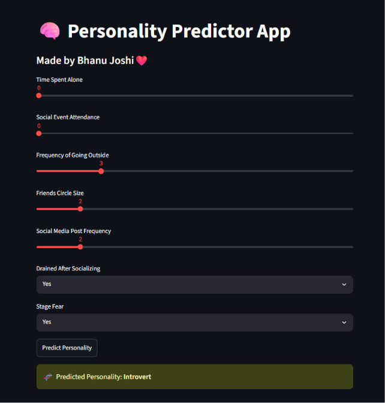

# 🧠 Personality Predictor

🚀 **Live Demo:** https://personality-predictor-bhanu.streamlit.app/

## 📸 Preview

<p align="center">    </p>

---

This Machine Learning + Streamlit application predicts whether a person is likely to be an Introvert or an Extrovert based on behavioral inputs.

The project was built to practice machine learning model development, deployment, and building interactive web applications using Streamlit.

---

## ✨ Features

* Predicts personality based on user input
* Interactive and easy-to-use Streamlit interface
* Displays prediction results instantly
* Deployed on Streamlit Community Cloud

---

## 🛠️ Tech Stack

* Python
* Streamlit
* Scikit-learn
* Pandas
* NumPy
* Joblib

---

## ⚙️ Installation

```bash
git clone https://github.com/bhanu-joshi01/Personality-Predictor.git
cd Personality-Predictor
pip install -r requirements.txt
streamlit run app.py
```

---

## 👨‍💻 Author

Made with ❤️ by **Bhanu Joshi**

If you found this project useful, consider giving it a ⭐.

